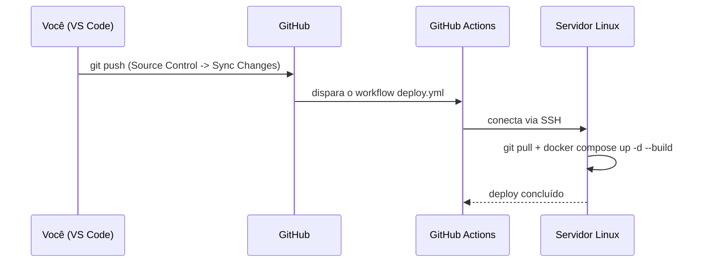

# DEPLOY.md — Deploy automático (adeus FileZilla)

Este documento explica como funciona a automação: **você edita no VS Code →
dá push → o servidor se atualiza sozinho**, sem copiar arquivo nenhum
manualmente.

## Como as peças se encaixam



Duas partes que **já vieram prontas** neste projeto:
- `scripts/deploy.sh` — script que roda **dentro do servidor**: busca o
  código novo do GitHub e reconstrói os containers.
- `.github/workflows/deploy.yml` — o "robô" que roda **no GitHub**, toda vez
  que você faz push na branch `main`, conecta no servidor via SSH e executa
  o `deploy.sh` por você.

O que falta é só configurar as credenciais (uma vez) para o GitHub conseguir
acessar seu servidor com segurança. É isso que os passos abaixo fazem.

---

## Passo 1 — Preparar o servidor pra receber deploy via Git

No servidor (via SSH, do jeito que você já acessa hoje), faça o clone
**uma única vez**:

```bash
cd /opt   # ou a pasta que preferir
git clone https://github.com/seu-usuario/facilita-vistorias-app.git
cd facilita-vistorias-app
cp .env.example .env
nano .env   # preencher as variáveis reais de produção (ver SETUP.md)
chmod +x scripts/deploy.sh
docker compose up -d --build
```

A partir daqui, essa pasta no servidor é a "produção" — o `deploy.sh` sempre
atualiza ela, nunca precisa clonar de novo.

## Passo 2 — Criar uma chave SSH dedicada para o GitHub acessar o servidor

**Não reutilize sua chave SSH pessoal.** Crie uma só para isso, sem senha
(passphrase vazia, porque vai rodar de forma automática):

```bash
ssh-keygen -t ed25519 -C "github-actions-deploy" -f ~/.ssh/github_deploy_key -N ""
```

Isso gera dois arquivos:
- `~/.ssh/github_deploy_key` (privada — **nunca compartilhe, vai pro GitHub como secret**)
- `~/.ssh/github_deploy_key.pub` (pública — vai pro servidor)

Autorize a chave pública no servidor:

```bash
cat ~/.ssh/github_deploy_key.pub >> ~/.ssh/authorized_keys
```

> Se você já está gerando essa chave em outra máquina que não o servidor,
> lembre de copiar a `.pub` para dentro do `~/.ssh/authorized_keys` **do
> servidor**, não da sua máquina local.

## Passo 3 — Cadastrar os "Secrets" no repositório do GitHub

No GitHub → seu repositório → **Settings → Secrets and variables →
Actions → New repository secret**. Criar 4 secrets:

| Nome do secret | Valor |
|---|---|
| `DEPLOY_HOST` | IP ou domínio do servidor (ex.: `123.45.67.89`) |
| `DEPLOY_USER` | usuário SSH usado pra conectar (ex.: `osmar` ou `root`) |
| `DEPLOY_SSH_KEY` | conteúdo **completo** do arquivo `~/.ssh/github_deploy_key` (a privada, do passo 2) — copie com `cat ~/.ssh/github_deploy_key` e cole tudo, incluindo as linhas `-----BEGIN...` e `-----END...` |
| `DEPLOY_PORT` | porta SSH do servidor (geralmente `22`) |

E mais um, direto no arquivo (não é secret, mas confirme o caminho):
- Em `.github/workflows/deploy.yml`, o campo `DEPLOY_PATH` também vem de um
  secret — crie ele também: `DEPLOY_PATH` = caminho completo da pasta no
  servidor (ex.: `/opt/facilita-vistorias-app`).

## Passo 4 — Testar

1. Faça qualquer alteração pequena (ex.: mude uma linha no `README.md`).
2. No VS Code: Source Control → commit → **Sync Changes**.
3. No GitHub, vá na aba **Actions** do repositório — deve aparecer o
   workflow "Deploy para produção" rodando (bolinha amarela → verde quando
   terminar).
4. Se der ✅ verde, é isso — o servidor já está atualizado.
5. Se der ❌ vermelho, clique no workflow pra ver o log do erro (geralmente é
   secret errado, permissão de `authorized_keys`, ou caminho do `DEPLOY_PATH`).

## Fluxo do dia a dia, depois de configurado

```
Editar arquivo no VS Code
        ↓
Source Control → escrever mensagem → Commit
        ↓
Sync Changes (push)
        ↓
[automático] GitHub Actions builda e atualiza o servidor
        ↓
Site em produção atualizado em ~1-3 minutos
```

Você nunca mais precisa abrir o FileZilla, nem lembrar qual arquivo mudou —
o `git push` sempre leva **tudo** que você commitou, e o `deploy.sh` sempre
deixa o servidor **idêntico** ao GitHub (`git reset --hard`), então não tem
como "esquecer" um arquivo.

## Cuidados importantes

- **`.env` nunca vai pro Git** (confira se `.gitignore` tem a linha `.env`)
  — ele é preenchido uma vez direto no servidor, no Passo 1, e fica lá. Se
  você mudar uma variável de ambiente, edita direto no servidor
  (`nano .env` + `docker compose up -d`), isso não passa pelo GitHub Actions.
- Se quiser revisar antes de ir pro ar, crie outras branches
  (`git checkout -b feature/nova-tela`) e só dê merge/push na `main` quando
  estiver pronto — o deploy automático só dispara na `main`.
- Para desligar a automação temporariamente (ex.: manutenção), vá em
  **Settings → Actions → General** no GitHub e desabilite o workflow, ou
  simplesmente não faça push na `main` até estar pronto.
