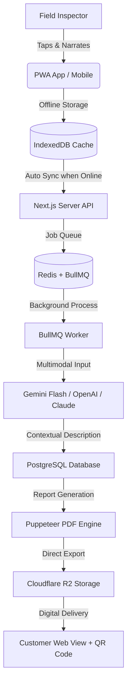

# ⚡ Facilita Vistorias App
### **AI-Powered, Offline-First Real Estate Inspection Platform**

[](https://nextjs.org/)
[](https://www.prisma.io/)
[](https://bullmq.io/)
[](https://deepmind.google/technologies/gemini/)
[](https://www.cloudflare.com/products/tunnel/)

---

## 🚀 The Vibe Coding Showcase
> **Built at the speed of thought.**
> This project stands as a prime example of **Agentic AI & Vibe Coding**—where high-level human architecture, systems engineering, and state-of-the-art AI pair programming converge to produce production-grade software in record-breaking cycles. 
> 
> *Are you a tech recruiter or engineering manager looking for developers who master the future of AI-augmented software creation? You are looking at the result of it.*

---

## 📖 Table of Contents
1. [What It Does](#-what-it-does)
2. [Why It is Useful](#-why-it-is-useful)
3. [System Architecture](#%EF%B8%8F-system-architecture)
4. [Tech Stack & Special Features](#-tech-stack--special-features)
5. [Getting Started](#-getting-started)
6. [Support & Help](#-support--help)
7. [Who Maintained This](#-who-maintained-this)

---

## 🔍 What It Does

**Facilita Vistorias App** is a self-hosted, internal enterprise platform designed for property inspectors to perform rapid, high-accuracy field inspections. 

Instead of typing out tedious descriptions or typing notes post-visit:
1. The inspector **takes a photo** of the item (e.g., a door, wall, floor).
2. The inspector **speaks a brief description** of what they see.
3. The offline-first app caches everything securely.
4. Once online, a **multimodal AI pipeline** merges the audio transcription with visual details in the photo to automatically generate a formal, technical description.
5. The system generates an interactive digital report (accessible via URL/QR Code) and a professional PDF.

---

## 💡 Why It Is Useful

- **80% Reduction in Report Compilation Time**: Inspectors capture data in minutes; AI handles the formatting and phrasing.
- **Offline-First Resilience**: Works flawlessly in high-rise basements or remote areas with poor reception. Data is queued locally and synced when signal returns.
- **Contextual Multimodal Fusion**: The AI doesn't just transcribe; it reasons. If the inspector says *"scratch on the frame"* without stating the color, the AI identifies the *"white wood frame"* from the photo and creates a complete record.
- **Built-in Compliance Engine**: Automatically enforces regulatory constraints (e.g., swapping restricted terms like "laudo" to legally compliant terminology like "relatório de vistoria" based on strict business logic).

---

## 🛠️ System Architecture

Here is how the sync and processing pipeline works under the hood:



---

## 💻 Tech Stack & Special Features

- **Frontend & Routing**: Next.js 15 (App Router, Standalone output) & React 19.
- **Database Layer**: PostgreSQL managed via Prisma ORM for type-safe queries.
- **Offline Queuing**: Service Workers & IndexedDB for local-first reliability.
- **Asynchronous Pipeline**: Redis and BullMQ managing processing tasks so the main thread never blocks.
- **Document Engine**: Puppeteer running headlessly in Docker to print pixel-perfect reports.
- **AI Integrations**: Gemini API (native standard) with custom settings allowing hot-swappable local LLM proxies (Omniroute / OpenRouter / DeepSeek).
- **Secure Networking**: Cloudflare Tunnels bypassing open firewall ports for zero-trust security.

---

## 🚀 Getting Started

### Prerequisites
- Node.js v20+ & Docker
- Google AI Studio API Key (or fallback credentials)
- Cloudflare Tunnel setup (optional for local dev)

### Local Development Setup
1. Clone the repository:
   ```bash
   git clone https://github.com/<username>/facilita-vistorias-app.git
   cd facilita-vistorias-app
   ```

2. Setup environment variables:
   ```bash
   cp .env.example .env
   # Edit .env with your DATABASE_URL, NEXTAUTH_SECRET, and GEMINI_API_KEY
   ```

3. Spin up support infrastructure (Postgres, Redis, MinIO):
   ```bash
   docker compose up -d postgres redis minio
   ```

4. Install dependencies and run migrations:
   ```bash
   npm install
   npm run prisma:migrate
   ```

5. Start the hot-reloading development server:
   ```bash
   npm run dev
   ```
   Open `http://localhost:3000` to view the app!

---

## 🤝 Support & Help

If you encounter issues or have questions regarding deployment:
- Open a GitHub issue on this repository.
- Consult the internal documentation files:
  - [`PRD.md`](../PRD.md) - Product Requirements and Scope.
  - [`SYSTEM_DESIGN.md`](../SYSTEM_DESIGN.md) - Deep architectural breakdown.
  - [`SETUP.md`](../SETUP.md) - Infrastructure and Cloudflare configuration guidelines.
  - [`CLAUDE.md`](../CLAUDE.md) - Coding instructions and restricted terms dictionary.

---

## ✍️ Who Maintained This

This repository is designed, maintained, and continuously enhanced by:
- **Osmar Gonçalves** — *Lead Systems Engineer & Vibe Coding Pioneer* 🚀

*Interested in bringing high-speed, AI-integrated workflows and robust fullstack architectures to your organization? [Let's connect!](https://github.com/Henzen3d/)*

