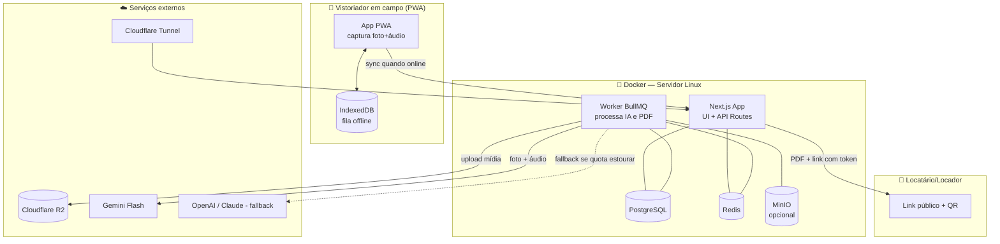
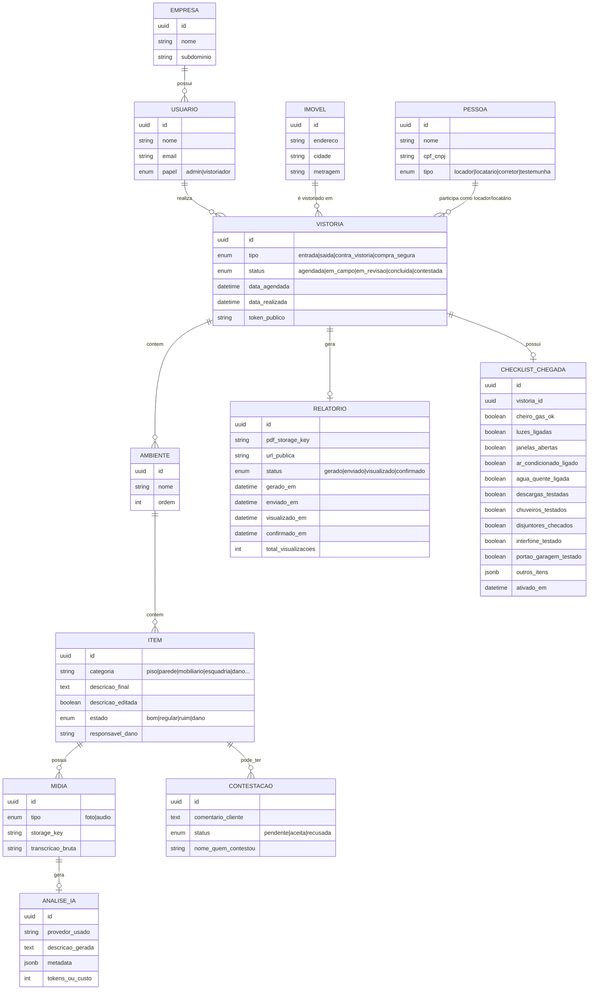
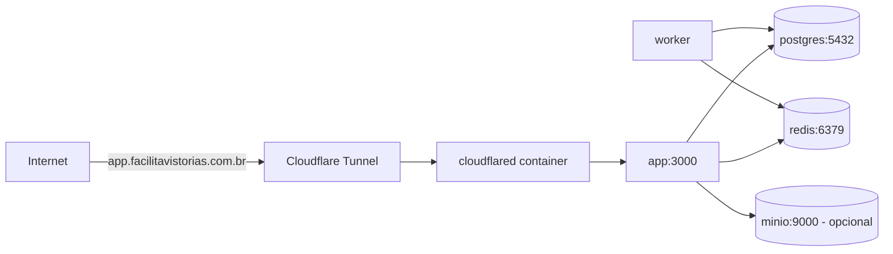

# SYSTEM_DESIGN — Facilita Vistorias App
 
## 1. Stack
 
| Camada | Escolha | Motivo |
|---|---|---|
| Framework | **Next.js 15** (App Router, TypeScript) | Full-stack único (UI + API routes), bom suporte a PWA, deploy simples em container |
| Banco de dados | **PostgreSQL 16** | Robusto, JSON nativo (`jsonb` para payloads de IA), tipos fortes, produção-ready |
| ORM | **Prisma** | Migrations versionadas, tipagem automática ponta a ponta |
| Fila/Jobs | **BullMQ + Redis** | Processamento assíncrono de IA e geração de PDF sem travar a UI |
| Storage de mídia | **Abstração S3-compatível** (MinIO local *ou* Cloudflare R2) | Ver seção 5 |
| IA multimodal | **Google Gemini Flash** (padrão/free-tier) com **fallback pago configurável** (OpenAI / Claude) | Ver seção 4 |
| PDF | **Puppeteer** (HTML → PDF) | Reaproveita o mesmo template React/HTML do relatório digital |
| PWA/offline | **next-pwa** + **IndexedDB** (via `idb`) | Fila local de captura, sync em background |
| Auth | **NextAuth (Auth.js)** com Credentials + tokens públicos assinados (JWT) para acesso do cliente | Um único mecanismo cobre admin/vistoriador (login) e cliente (link com token) |
| Deploy | Docker Compose + **Cloudflare Tunnel** | Sem expor porta pública, subdomínio gerenciado pela Cloudflare |
 
## 2. Arquitetura geral
 

 
## 3. Modelo de dados (visão simplificada)
 

 
Observações importantes:
- `token_publico` da vistoria (e/ou por relatório) é um UUID/JWT usado na URL
  pública de visualização — mesmo padrão do `validar_vistoria.php?token=...`
  do Devolus, mas assinado (JWT) em vez de apenas opaco.
- `ANALISE_IA` guarda **qual provedor** processou aquele item, custo/tokens e
  a resposta bruta — essencial para auditar a estratégia de fallback (ver §4)
  e trocar de provedor no futuro sem perder histórico.
- Nenhuma entidade ou label de UI usa a palavra "laudo" — usar `Relatorio`,
  `RelatorioFotografico` na nomenclatura de código também, para não vazar o
  termo em nenhuma tela por acidente.
- `RELATORIO.status` é um fluxo linear — `GERADO` (PDF pronto) →
  `ENVIADO` (equipe compartilhou o link) → `VISUALIZADO` (cliente abriu pela
  1ª vez) → `CONFIRMADO` (cliente clicou em "confirmo que recebi e
  revisei") — ver §7 e a tela de acompanhamento no painel admin (§11).
- `ITEM.descricao_editada` vira `true` assim que o vistoriador/admin altera
  o texto sugerido pela IA — é a base da métrica "% aceito sem edição" do
  dashboard (§11), sem precisar comparar strings em tempo de consulta.
- `ChecklistChegada` gerencia o Protocolo de Chegada (segurança e ativação antecipada) com registros de ativação e estados individuais. É persistido offline no IndexedDB e sincronizado com o servidor.

## 4. Pipeline de IA (foto + áudio → descrição do item)
 
Mesma filosofia do NexusLocal: **roteador de provedores com fila de
prioridade**, começando pelo tier gratuito e caindo para pago apenas quando
necessário.
 
```
1. Worker pega o job do item (1+ fotos, 1 áudio) da fila BullMQ
2. AIProviderRouter tenta, em ordem de AI_PROVIDER_PRIORITY:
     a. Google Gemini Flash (multimodal nativo: aceita imagem + áudio
        no mesmo prompt, sem precisar de STT separado)
     b. [fallback pago, configurável] OpenAI GPT-4o-mini (visão) + Whisper (áudio)
     c. [fallback pago, configurável] Claude (visão) + provedor de STT externo
3. Prompt fixo instrui o modelo a:
     - Transcrever/resumir o que o vistoriador falou
     - Descrever objetivamente o que é visível na foto
     - Complementar detalhes ditos incompletos (cor, material, estado
       aparente) SEM inventar avarias que não estão visíveis
     - Nunca usar a palavra "laudo" no texto gerado
     - Retornar JSON estruturado: { descricao, estado_sugerido, detalhes[] }
4. Resultado salvo in ANALISE_IA (com provedor usado, custo estimado)
   e uma cópia editável em ITEM.descricao_final
5. Se todos os provedores falharem/excederem quota: item fica marcado
   "aguardando IA" e some no painel de revisão, sem travar o fluxo do
   vistoriador em campo.
```
 
Controle de free-tier: um contador (`ai_usage` em Redis/Postgres) por
provedor/mês decide quando o router pula para o próximo da lista — mesma
lógica de circuito da Cache Inteligente do NexusLocal, só que aplicada a
provedores de IA em vez de cache semântico.
 
## 5. Abstração de storage (MinIO ↔ Cloudflare R2)
 
Ambos são S3-compatíveis, então uma única interface serve para os dois:
 
```ts
interface StorageProvider {
  upload(key: string, file: Buffer, contentType: string): Promise<string>;
  getSignedUrl(key: string, expiresInSec?: number): Promise<string>;
  delete(key: string): Promise<void>;
}
```
 
- `STORAGE_PROVIDER=r2` (padrão) → usa `@aws-sdk/client-s3` apontando para o
  endpoint R2 da conta Cloudflare (sem custo de egress, bom para servir fotos
  em relatórios acessados externamente).
- `STORAGE_PROVIDER=minio` → mesmo client S3, apontando para o serviço
  `minio` do `docker-compose.yml` (útil para desenvolvimento local, ambiente
  sem internet, ou como storage primário caso se opte por manter tudo dentro
  de casa).
- Trocar de provedor é apenas mudar a env var — nenhuma mudança de código.

## 6. PWA e fluxo offline
 
- `next-pwa` gera o service worker; app é instalável no celular do
  vistoriador (ícone na tela inicial, abre em tela cheia).
- Dados da vistoria do dia (imóvel, ambientes planejados) são pré-carregados
  em IndexedDB quando o vistoriador abre a vistoria com sinal.
- Cada captura (foto/áudio) é salva **localmente primeiro** com status
  `pendente_sync`; um Background Sync (ou polling ao reconectar) envia o
  arquivo para `/api/vistorias/[id]/itens/[itemId]/midia` assim que há
  conexão.
- UI sempre mostra claramente quais itens ainda estão "salvos só no
  aparelho" vs "sincronizados", para o vistoriador nunca perder o controle.
 
## 7. Geração do relatório (PDF + link público) e rastreamento de status
 
1. Endpoint `/api/vistorias/[id]/finalizar` dispara job de geração.
2. Worker renderiza um template React (mesmo componente usado na página
   pública) para HTML e usa Puppeteer para exportar PDF.
3. QR code (`qrcode` npm) é gerado apontando para
   `https://app.facilitavistorias.com.br/r/[token]` e embutido no rodapé do PDF.
4. PDF é salvo no storage configurado; `Relatorio.url_publica` e
   `pdf_storage_key` são gravados. `Relatorio.status` começa em `GERADO`.
5. Página pública `/r/[token]` (Next.js Server Component) mostra o relatório
   navegável com fotos em alta resolução — mesma ideia do link do Devolus,
   mas sem exigir download para visualizar.

**Transições de status** (alimentam a tela de acompanhamento do admin, §11):
 
| Transição | Disparada por | Campos atualizados |
|---|---|---|
| `GERADO` → `ENVIADO` | Admin/vistoriador clica em "Compartilhar" (WhatsApp/e-mail) na tela de sucesso | `enviadoEm` |
| `ENVIADO` → `VISUALIZADO` | Primeiro `GET /r/[token]` bem-sucedido (verificação de token válido) | `visualizadoEm` (só na 1ª vez), `totalVisualizacoes` incrementa a cada acesso |
| `VISUALIZADO` → `CONFIRMADO` | Cliente clica em "Confirmo que recebi e revisei este relatório" na página pública | `confirmadoEm`, `nomeQuemConfirmou` |
 
Uma vistoria pode ficar "presa" em `VISUALIZADO` por dias sem o cliente
confirmar — é exatamente esse cenário que a tela de acompanhamento do admin
precisa deixar visível (ver §11), para a equipe poder cutucar o cliente
manualmente se o prazo de contestação estiver se esgotando.
 
## 8. Autenticação e papéis
 
| Papel | Acesso | Mecanismo |
|---|---|---|
| Admin | Painel completo, todas as vistorias, configurações | NextAuth (email+senha) |
| Vistoriador | Só suas vistorias atribuídas, app de campo | NextAuth (email+senha), sessão longa (7 dias) no PWA |
| Cliente (locatário/locador) | Só a vistoria específica, via link | JWT assinado no link, sem login/senha, expira conforme prazo de contestação configurado |
 
## 9. Deploy (Docker + Cloudflare Tunnel)
 

 
- `cloudflared` roda como serviço no mesmo `docker-compose.yml`, autenticado
  com um token de túnel (`TUNNEL_TOKEN`), sem precisar abrir portas no
  firewall do servidor.
- Subdomínio definido: `app.facilitavistorias.com.br` (separado do
  site institucional, mesma raiz de domínio).

## 10. Segurança e LGPD
 
- CPF de locador/locatário e assinaturas são dados pessoais sensíveis — criptografar em repouso (`pgcrypto` ou coluna cifrada) e nunca logar em texto puro.
- Links públicos de relatório expiram (JWT `exp`) após prazo de contestação + margem de segurança configurável.
- Fotos/áudios só ficam acessíveis via URL assinada temporária (`getSignedUrl`), nunca com bucket público.
- Política de retenção: mídia de vistorias concluídas há mais de N meses pode ser arquivada/comprimida (a definir com o negócio).

## 11. Painel admin — dashboard de métricas e acompanhamento
 
Adicionado após revisão de UX (ver `TODO.md`) — o painel admin não é só uma
lista de vistorias, precisa responder "como está a operação" e "o que está
travado esperando o cliente" de relance. Todas as métricas abaixo são
calculadas via query agregada em cima do schema existente (nenhuma tabela
de métricas separada é necessária no MVP):
 
| KPI | Fonte / cálculo |
|---|---|
| Vistorias concluídas no mês | `COUNT(Vistoria) WHERE status = CONCLUIDA AND dataRealizada` no mês |
| Vistorias agendadas (próximos 7 dias) | `COUNT(Vistoria) WHERE status = AGENDADA AND dataAgendada BETWEEN hoje E +7d` |
| Tempo médio de entrega | `AVG(Relatorio.geradoEm - Vistoria.dataRealizada)` |
| % descrições aceitas sem edição | `COUNT(Item WHERE descricaoEditada = false AND tem AnaliseIA) / COUNT(Item WHERE tem AnaliseIA)` — habilitado pelo novo campo `Item.descricaoEditada` |
| Distribuição de status | `GROUP BY Vistoria.status` — alimenta o gráfico de status do dashboard |
| Relatórios aguardando confirmação | `COUNT(Relatorio) WHERE status = VISUALIZADO AND visualizadoEm < hoje - N dias` — lista de "cutucar cliente" |
| Taxa de contestação | `COUNT(Vistoria WHERE status = CONTESTADA) / COUNT(Vistoria WHERE status = CONCLUIDA)` |
 
**Tela de acompanhamento de assinatura/verificação** (nova, identificada
como lacuna do plano original): lista as vistorias concluídas com uma
coluna de progresso visual `GERADO → ENVIADO → VISUALIZADO → CONFIRMADO`
(usando os timestamps de `Relatorio`, §7), permitindo à Vera Lúcia ver de
relance quais relatórios o cliente ainda não abriu ou não confirmou, sem
precisar abrir cada vistoria individualmente.
